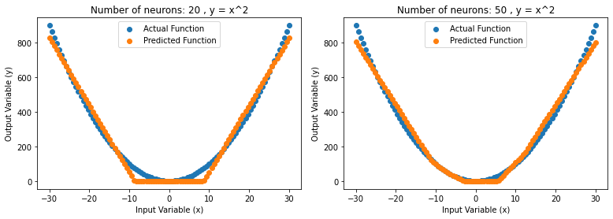
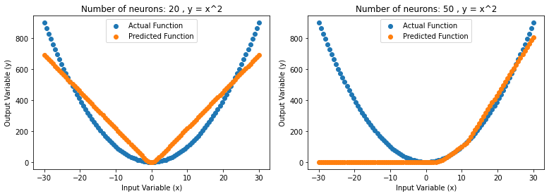
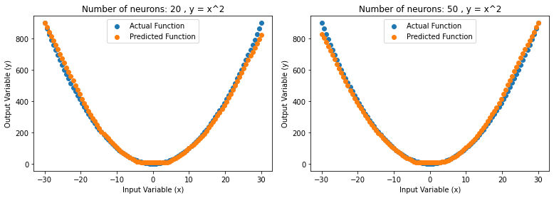
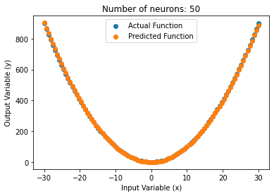

# Universal Approximation Theorem


The Universal approximation theorem claims that the standard multi-layer feedforward networks with a single hidden layer that contains finite number of hidden neurons
is able to approximate continuous functions with the usage of arbitrary activation functions. ([source](https://citeseerx.ist.psu.edu/viewdoc/download?doi=10.1.1.101.2647&rep=rep1&type=pdf))

However, the ability of the neural network to approximate any continuous functions mapping the input to the output goal is constraint by the number of neurons, hidden layers and many techniques utilised during the training process of the network. Intuitively, you can think of this as whether are there possibly enough computational units and operations set up to approximate a continuous function that can properly map the input to the output. The ability to approximate is also highly dependent on efficiency of the optimization routine that we use. These parameters determining the set up and training of the neural network is commonly known as hyperparameters.

Example of hyperparameters we can tune in the code:

1. Network structure. (Number of hidden layers, number of neurons)

```
model = nn.Sequential(     
          nn.Linear(1, n_neurons),
          nn.ReLU(),
          #nn.Linear(n_neurons,n_neurons),
          #nn.ReLU(),        
          nn.Linear(n_neurons,1),
          nn.ReLU()
          )
```

2. Number of epochs (number of time we go through all the data), `line 57`

3. Loss function and optimizer, there are so many optimizer available, check it out [here](https://pytorch.org/docs/stable/optim.html):
```
optimizer = optim.RMSprop(model.parameters(), lr=learning_rate) # define optimizer
#optimizer = optim.SGD(model.parameters(), lr=learning_rate)

criterion = nn.MSELoss() # define loss function

```

We can run some experiments in code to better understand the concept of approximation. Given that the function we are trying to approximate has the relationship of y = x^2, we can run some experiments to gauge how many neurons for a single hidden layer is necessary to fit the y=x^2 curve and tune hyperparameters in search for the best results.




From the figure above, we can see the with 20 neurons in a single hidden layer, the neural network is able to approximate the function pretty well just by training on the output values. Increasing to 50 neurons in the single hidden layer provided us with better results. 

In theory, the universal approximation theorems implies that neural networks can approximate a wide variety of functions very well when given an appropriate combination values. However, learning to construct the network with the appropriate values is not always possible due to the constraint/challenges when training the network in search for such values.




From the figure above,the same architecture of a single hidden layer, the network approximates very poorly. This is due to the fact that training the neural network does not always provide us with precise/perfect values. Therefore, we have to be aware that even though theoretically the neural network could approximate a very accurate continuous function mapping, it may fail to approximate close to the expected continuous function as the training process of the neural network comes with its own challenges.





Running another experiment, we connected another hidden layer with 20 neurons and 50 neurons, the results can be seen in the figure above. It can be observed that the approximation of the predicted function is much better without spending any time tuning the training parameters which is of expectation. Increasing the neurons and connections present in search for better approximation is a pretty good heuristic but we have to remember that in the process of training the neurons lies a few challenges too that may deter the neural network from learning the best values needed to approximate the function even if more than enough nodes are available in theory.





Another important takeaway from the experiment is that by spending more time tuning the hyperparameters of the neural network, we can actually get a near perfect approximation with the same architecture of 1 hidden layer with 50 neurons as shown in the figure above. It can be observed that the results are even better than using 2 hidden layers with bad hyperparameters. The experiment with 2 hidden layers can definitely approximate better if we spend more time tuning hyperparameter. This shows how important is the optimization routine and certain hyperparameters are to training the network. With 2 layers and more neurons, it does not take much tuning to get a good result because there are more connections and nodes to use. However, as we add more nodes and layers, it gets more computationally expensive. 

Lastly, if the relationship is too complex, 1 hidden layer with 50 neurons may not even theoretically be able to approximate the input to output mapping well enough in the first place. y=x^2 is a relatively easy relationship to approximate but we can think of relationship of inputs such as images. The relationship of image pixel values to the classification of the image is ridiculously complex where not even the best mathematician can possibly come out with an appropriate function. However, we can use neural networks to approximate such complex relationship by adding more hidden layers and neurons. This gave birth to the field of Deep Learning which is a subset of Machine Learning focusing on utilising neural network with a lot of layers (deep neural networks) to learn very complex function mappings.


# Recommendation

Please do try other functions such as `sin(x)` or `cos(x)` and see whether can u approximate the relationship. You may keep failing till you get the hyperparameters right but it will give you a good insight into tuning hyperparameters. I suggest if the function is too hard to approximate, go ahead and add more layers and neurons! 

